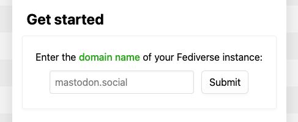
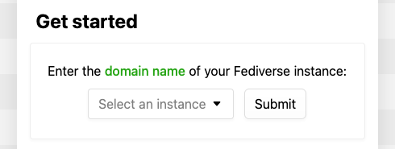

# fediiverse configuration
fediiverse configuration is stored in config.json. The first-time-config.py utility handles first-time
configuration, but you can also edit some options later on.

**Make sure you restart all services after editing the config!**

## Example config.json
```json
{
  "log_path": "/var/log/nginx/fediiverse",
  "proxy_upstream_https": "127.0.0.1:8443",
  "hosts": {
    "common_name": "*.fediiverse.local",
    "welcome_host": "fediiverse.local",
    "discovery_host": "d.fediiverse.local",
    "olv_host": "olv.fediiverse.local",
    "img_host": "img.fediiverse.local",
    "setup_host": "setup.fediiverse.local"
  },
  "secrets": {
    "temporal_secret_key": "YWJjZGVmZ2hpamtsbW5vcHFyc3R1dnd4eXo=",
    "session_token_secret_key": "enl4d3Z1dHNycXBvbm1sa2ppaGdmZWRjYmE="
  },
  "instances": {
    "blocklist": ["example.com"],
    "blocklist_url": "https://raw.githubusercontent.com/gardenfence/blocklist/refs/heads/main/gardenfence.txt",
    "blocklist_cache_duration": "P1W",

    "allowlist": ["instance.host"],
    "allowlist_dropdown": true,
    
    "instance_placeholder": "mastodon.social"
  },
  "welcome": {
    "additional_intro_html": "A fediiverse instance for our community ⭐️"
  },
  "mode": "PROD"
}
```

## `log_path`
`log_path` determines log paths for the fediiverse nginx config. To rebuild the nginx config using a new path,
run `build-nginx-configuration.py`, otherwise changing this will have no effect.

## `proxy_upstream_https`
(Optional) `proxy_upstream_https` lets you specify a socket address upstream of the fediiverse nginx server.  

When the fediiverse nginx configuration encounters a request using modern TLS, it passes traffic to the address 
specified in `proxy_upstream_https`. This allows you to host both 3DS-facing fediiverse services and normal web-browser 
facing services on the same machine. To rebuild the nginx config, run `build-nginx-configuration.py`, otherwise 
changing this will have no effect.

## `hosts`
The hosts used for this fediiverse instance. **You should treat this as read-only** because certificates, clients,
OAuth redirect URLs, 3DS saved patches and more depend on the domain name not changing over time.  
If you want to move your fediiverse instance to a new domain name, please run first-time-config.py again and delete
`storage.db` from your fediiverse storage path. After changing the domain name, all previously connected 3DS devices
will have to log in and run the fediiverse Setup Utility again.

## `secrets`
Stores the [Fernet](https://cryptography.io/en/latest/fernet/) secrets used to encrypt temporary state (`temporal_secret_key`)
and login sessions (`session_token_secret_key`).  
Don't edit these secrets manually! To refresh the secrets and log out all users, use the `refresh-secrets.py` script.

## `instances`
Controls which instances are accepted by the welcome service. 

Note: this does not currently affect existing sessions, only which instances are accepted by the welcome form, 
so users who logged in before a now-blocked instance was blocked will still be able to use the service as long as they 
stay logged in. You can log out all users by running the `refresh-secrets.py` script.

### `blocklist`
(Optional) List of domains that will never be accepted for login. This applies in addition to `blocklist_url`, and
you can specify both. Domains that appear on either list will not be accepted.

### `blocklist_url`
(Optional) URL to download a blocklist from. The URL must contain a newline-separated list of domain names.
By default, fediiverse uses the [gardenfence blocklist](https://github.com/gardenfence/blocklist).

### `blocklist_cache_duration`
(Optional) How long to cache the blocklist from `blocklist_url` in ISO8601 duration format. 
fediiverse will cache the blocklist in the file `cached-blocklist.json` in your fediiverse directory.
If fediiverse cannot reach the blocklist URL, an outdated blocklist may be used even if it is older than
the update interval. If the cached blocklist file is missing or malformed, fediiverse may download a new blocklist
even if it was last updated within the cache duration period.

### `allowlist`
(Optional) List of domains that will EXCLUSIVELY be accepted by the welcome service.
If specified, ONLY these domains will be allowed.  Use this if you want to host a fediiverse instance for just
one (or multiple) specific Mastodon instance(s).

`allowlist` does not override blocklists, so an allowlisted domain may still be rejected if
it is blocked by either the local blocklist or the downloaded blocklist.

### `allowlist_dropdown`
Whether to show a dropdown of allowlisted domains instead of an input box on the Welcome page. Only applies if `allowlist`
is specified. This is useful if you intend your fediiverse instance to be used by people on specific instances.

`"allowlist_dropdown": false`:  


`"allowlist_dropdown": true`:  


### `instance_placeholder`
Placeholder domain to use in the instance input box. Does nothing when in dropdown mode.

## `welcome`
Options for the welcome page.

### `additional_intro_html`
(Optional) Additional HTML for the welcome index page. It will be placed in a `<p>` between the two paragraphs
at the top of the page. This is useful for explaining more about the instance.   

Example: if this is a fediiverse instance for the Mastodon instance "mastodon.example", you could set `additional_intro_html` to
`"This is a fediiverse instance for the mastodon.example community."`

If there is a policy for use of the service, you could set `additional_intro_html` to
`"<a href="https://example.com/policy">By using this service, you agree to the policies...</a>"`

## `mode`
The caching mode of your fediiverse instance. Mode can be either `PROD` (default) or `DEV`. You should keep this set to `PROD`
unless you are working on the development of fediiverse.

In DEV mode, caching is disabled, and the 3DS will refetch all scripts/assets/styles on every navigation. This is useful for
development.
